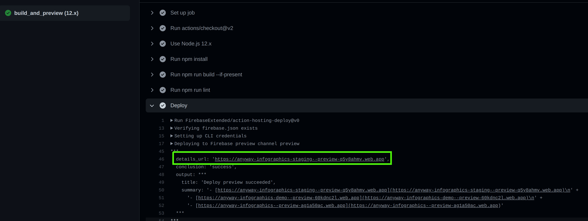

[](https://github.com/hasadna/anyway-newsflash-infographics/actions?query=workflow%3Adeploy-development) [](https://github.com/hasadna/anyway-newsflash-infographics/actions?query=workflow%3ACI)

# ANYWAY: Newsflash InfoGraphics

### Table of Contents

1. [ About the project ](#about)
1. [ Want to help? ](#help)
   1. [ Diving in ](#diving)
   1. [ Technical Overview for Developers ](#technical-overview)
   1. [ 3nd party libraries](#2nd-party-libraries)
   1. [ Project directory structure ](#directory-structure)
   1. [ Contribution Guidelines ](#contribution-guidelines)
      - [Code guidelines](#code-guidelines)
      - [Branch and PR naming](#branch-naming)
      - [Pull request naming](#pr-naming)
      - [Creating a PR](#creating-pr)
1. [ Server code ](#server-code)
1. [ Server API ](#server-api)
1. [ Environments and CI/CD ](#cicd)
1. [ Bundle size ](#bundle-size)
1. [ Git Scripts ](#git-scripts)
1. [ VScode & prettier ](#formatting)
1. [ Available Scripts ](#available-scripts)

## About this project: <a id="about"></a>

Learn more about our [Vision](https://github.com/hasadna/anyway-newsflash-infographics/blob/development/docs/Vision.md)

## Want to help? <a id="help"></a>
* Found a bug? feel free to open file a [bug report](https://github.com/hasadna/anyway-newsflash-infographics/issues/new?assignees=&labels=bug&template=bug-report.md&title=%5BBug%5D). If you're new to github - see our [How To](https://github.com/hasadna/anyway-newsflash-infographics/blob/dev/docs/HowTo.md) step by step tutorial. You can also contact use on email or slack(see below)
* Want contribute some code, help with our UI or improve documentation? Excellent! Please follow these steps

### First thing first

- Contact us - email would be great :) anyway@anyway.co.il
- After we've got your mail, you'll able to join our [Slack Channel](https://app.slack.com/client/T02G85W3A/CLWT1CLDQ). For any issues - contact Yuval or Atalya to get invitation.
- Optional: install [ZenHub](https://chrome.google.com/webstore/detail/zenhub-for-github/ogcgkffhplmphkaahpmffcafajaocjbd), so you can see our project [board](https://github.com/hasadna/anyway-newsflash-infographics#workspaces/anyway-5e00f3aa79454c5108bf2370/).

### Diving in <a id="diving"></a>

- For improving documentation:
  - see issues marked as [documentation](https://github.com/hasadna/anyway-newsflash-infographics/issues?q=is%3Aopen+is%3Aissue+label%3Adocumentation) and contact Yuval for guidance
  - This is a [good summary](https://medium.com/@kvosswinkel/coding-like-a-journalist-ee52360a16bc) for things to keep in mind when writing technical docs
- For feature development, bug fixing etc:
  - Read the [Technical Overview](https://github.com/hasadna/anyway-newsflash-infographics#technical-overview)
    and [Project directory structure](https://github.com/hasadna/anyway-newsflash-infographics#project-directory-structure) sections
  - Contact one of the project's leaders, which can help you getting into things easily
  - Select one of the issues marked as [good first issue](https://github.com/hasadna/anyway-newsflash-infographics/issues?q=is%3Aopen+is%3Aissue+label%3A%22good+first+issue%22)
  - Read [Contribution Guidelines](https://github.com/hasadna/anyway-newsflash-infographics#contribution-guidelines) before start working on an issue
- If you have any question - feel free to contact Yuval or Atalya from AnyWAY Project

### Technical Overview for Developers <a id="technical-overview"></a>

This project was bootstrapped with [Create React App](https://github.com/facebook/create-react-app).
You can learn more in the [Create React App documentation](https://facebook.github.io/create-react-app/docs/getting-started).

It is following [Atomic Design](https://bradfrost.com/blog/post/atomic-web-design/) guidelines with the following changes:

- There are no "Organisms" components.
- Atoms and Molecules are not state-aware (do not know MobX store exist)
- Templates and Pages are state-aware
- Molecules may contain other Molecules or Atoms. Atoms does not contain other Atoms.

##### Map keys

We use different google maps API keys for different environment.
Staging / Production key are limited to our domain, and included in the repo `.env.production`.
For using the map in development, You'll need to use a different key.

Steps:

1. Get development API key from frontend team leader / dev advocate
1. create a file named `.env.local` in your root directory (next to `.env`)
1. Set key-value in the following format:

```
REACT_APP_GOOGLE_MAP_KEY='THE_API_KEY_HERE'
```

3rd Party libraries included: <a id="2nd-party-libraries"></a>

- [React Router](https://reacttraining.com/react-router/web/guides/quick-start)
- [MobX](https://mobx.js.org/) - using [react-mobx-lite](https://github.com/mobxjs/mobx-react-lite) with [hooks](https://mobx-react.js.org/libraries)
- [Ten minute introduction to MobX and React](https://mobx.js.org/getting-started) - Learn how MobX works in 10 minutes!
- [axios](https://github.com/axios/axios)
- [Storybook](https://storybook.js.org/)
- [Material-UI](https://material-ui.com/)
- [Recharts](https://recharts.org/en-US/) - A composable charting library built on React components
- [Leaflet](https://leafletjs.com/) Interactive maps

Also,to upload google maps API script for the street view component, the 'react-async-loader' library was used as described in
https://github.com/edmund-dev/react-async-loader/blob/master/example/GoogleMap.jsx.

### Project directory structure <a id="directory-structure"></a>

```
.
+-- assets          // images, icons, audio etc.
+-- components      // internal components (anything other than page component)
|   +-- atoms
|   +-- molecules
|   +-- organisms
+-- hooks           // common reusable hooks
+-- models          // typescript interfaces and classes
+-- pages           // page components
+-- services        // REST API, websocket, storage etc.
+-- store           // MobX stores
+-- style           // css-in-js code and wrappers
|   +-- _globals.ts // sizes, colors etc. - can be divided as project grow
|   +-- theme.ts
+-- utils
+-- App.tsx
+-- index.html
+-- index.css      // global styles (like fonts or reset/normalize css code)
```

### Contribution Guidelines <a id="contribution-guidelines"></a>

##### Code  Guidelines <a id="code-guidelines"></a>
Can be found in a separate file. Check them out [here](https://github.com/hasadna/anyway-newsflash-infographics/blob/dev/docs/CodeGuidelines.md)

##### Branch naming <a id="branch-naming"></a>

Branch naming convention is as following
```
TYPE-ISSUE_ID-DESCRIPTION

examples:
feat-113-add-newsflash-location-on-map
fix-114-newsflash-location-not-accurate
```

##### PR naming <a id="pr-naming"></a>
Pull Request (PR) title convention is as following

```
[TYPE-ISSUE_ID]-DESCRIPTION

example:
[Feat-113] Add newsflash location on map
[Fix-114] Newsflash location not accurate
```

When `TYPE` can be:

- **feat** - is a new feature
- **doc** - documentation only changes
- **cicd** - changes related to CI/CD system
- **fix** - a bug fix
- **refactor** - code change that neither fixes a bug nor adds a feature

**All PRs must include commit message with the changes description!** 

Branching system:
_master_ - used for production <br>
_dev_ - anything else <br>
\* For the initial start, Use git clone command to download the repository to your computer (With `write` privileges there is no need to fork the repo)

##### Creating a PR <a id="creating-pr"></a>

A standard procedure for working on an issue would be to: 

1. `git pull dev`
2. Create new branch from `dev` , like: `refactor-137-making-pie-chart-generic-component`
3. Work - commit - repeat
4. Git pull at `dev`
5. On your branch: `git merge dev` and solve conflicts if they exist
6. Push branch and open PR to `dev`.
7. Get a code review approval / reject
8. After approval, merge your PR
9. GitHub will automatically delete the branch, after the merge is done. (they can still be restored).

If you never opened a PR on github - see our [How To](https://github.com/hasadna/anyway-newsflash-infographics/blob/dev/docs/HowTo.md) step by step tutorial

### Server code <a id="server-code"></a>

We have app server (written in [express](https://expressjs.com/), a node.js-based framework) which supports 2 functions:

- Cache API requests (from the backend data cluster)
- Provide user management capabilities
  [Our server repo](https://github.com/hasadna/anyway-newsflash-infographics-backend)

### Server API <a id="server-api"></a>

See [API document](https://docs.google.com/document/d/1Hv5ItvwM3z9nn95LjlsYHL-o18V8PgWrrQOKIPiPymU)

### Environments and CI/CD<a id="cicd"></a>

Active Environments:

- Staging - to be used internally by Anyway teams
- Production - Contains ready cards
- Demo - Contains ready cards & Demo Cards
- Mock - to be used to get demo mock information.

Environment base file is `.env`.
Each environment has a specific environment file which can be used to override `.env`. for example `.env.demo` will override `.env` for Demo environment. For more info see [CRA docs](https://create-react-app.dev/docs/adding-custom-environment-variables/) and [this post about env-cmd](https://medium.com/@rishi.vedpathak/react-environment-specific-builds-using-env-with-cra-and-env-cmd-5960a1253fe6)

We use [github actions](https://github.com/marketplace?type=actions) for the following flows:

1. [on-push CI](https://github.com/hasadna/anyway-newsflash-infographics/actions?query=workflow%3ACI) - provide per-PR CI testing and a live PR preview (see below)
1. [deploy-dev](https://github.com/hasadna/anyway-newsflash-infographics/actions?query=workflow%3Adeploy-development): continuous deployment of `dev` branch to Staging Environment - https://anyway-infographics-staging.web.app/
1. [deploy-master](https://github.com/hasadna/anyway-newsflash-infographics/actions?query=workflow%3Adeploy-development): continuous deployment of master branch to Production Environment:
* https://anyway-infographics.web.app/
* https://media.anyway.co.il/
1. [Deprecated] [deploy-demo](https://github.com/hasadna/anyway-newsflash-infographics/actions?query=workflow%3Adeploy-development): continuous deployment of demo branch to Demo Environment - https://anyway-infographics-demo.web.app/

Live Preview
Once you open a PR and all test pass successfully, a temporary live preview site will be created. Use it to see the changes and make sure everything works, before asking for a code review.

You can get the live preview url by pressing "Show all Checks" and than "Details" on the main PR page.
After clicking on "Details", the github action steps will be displayed. you can find the preview url under "Deploy" step (see image).


### About bundle size <a id="bundle-size"></a>

Since [Create React App](https://github.com/facebook/create-react-app) uses webpack under the hood,
You can safely use [named imports](https://stackoverflow.com/questions/36795819/when-should-i-use-curly-braces-for-es6-import/36796281#36796281)
when working with [Material UI components](https://material-ui.com/guides/minimizing-bundle-size/#how-to-reduce-the-bundle-size).

### Git Scripts <a id="git-scripts"></a>

Git scripts include in `package.json` to make working with git easier:

- `git:prune` - Remove tracking branches no longer on remote (run it around once a week)
- `git:merged` - Lists branches that have been merged into `dev`

### VScode & prettier <a id="formatting"></a>

Our `package.json` already include `prettier` section.
If you have your own settings for `VScode prettier extension`, make sure to use the project config.

We use `singleQuote` as default. If having trouble with making the VScode extension use single quotes, please use the following config:

```
{
  "prettier.jsxSingleQuote": true,
  "javascript.preferences.quoteStyle": "single",
  "typescript.preferences.quoteStyle": "single",
  "prettier.singleQuote": true
}
```

## Available Scripts <a name="available-scripts"></a>

In the project directory, you can run:

### `npm start`

Runs the app in the development mode.<br />
Open [http://localhost:3000](http://localhost:3000) to view it in the browser.

The page will reload if you make edits.<br />
You will also see any lint errors in the console.

### `npm test`

Launches the test runner in the interactive watch mode.<br />
See the section about [running tests](https://facebook.github.io/create-react-app/docs/running-tests) for more information.

### `npm run build`

Builds the app for production to the `build` folder.<br />
It correctly bundles React in production mode and optimizes the build for the best performance.

The build is minified and the filenames include the hashes.<br />
Your app is ready to be deployed!

See the section about [deployment](https://facebook.github.io/create-react-app/docs/deployment) for more information.

### `npm run sb`

Run [storybook](https://storybook.js.org/docs/configurations/cli-options/#for-start-storybook) locally.
