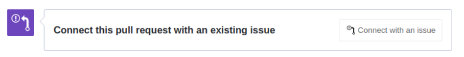
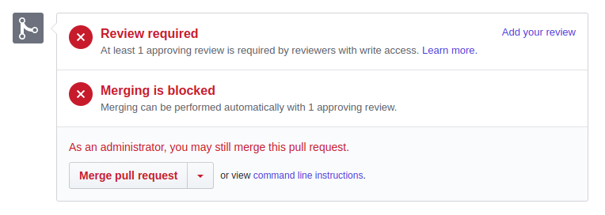
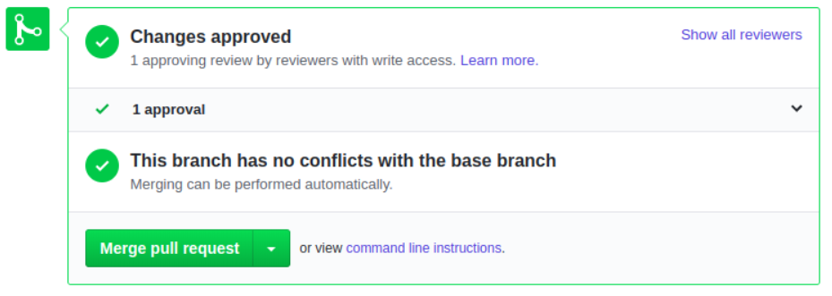
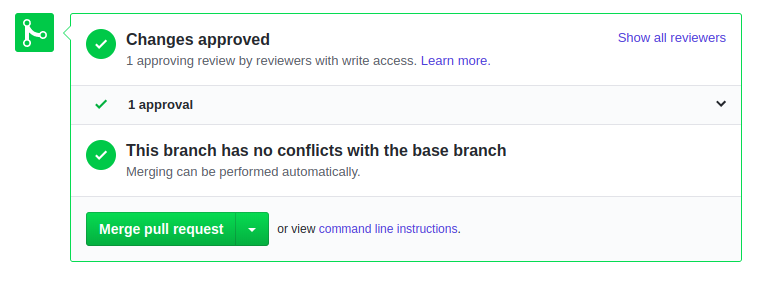

# How To - Step by Step guides for new developers
- ### [How To Open PR](#openpr)
- ### [How To Open a Bug](#openbug)

### How To Open a PR (Pull Request) ↸  [🔼](#howtocontent)
The following steps will guide you through PR process:
Once your branch has been merged with development, resolved conflicts and push into GitHub, a PR (Pull Request)
to be performed.
1. Go to  Pull Request >> Compare and pull request

2. Add issue label (doc, bug etc.) and issue number to the title.
3. write a comment.
4. Connect your PR with the relevant issue.

5. Request for a review, otherwise the PR might fail.
	See below -failed PR.

6. Create pull request.
7. Wait for reviewer comments(reject) or approved ( if rejected, resolve reviewer comments ,commit and push)

8. Once changes approved, you will be able to Merge Pull Request.

9. GitHub will automatically delete the branch, after the merge is done. (they can still be restored).
10. Hooray, you are done, cherish the moment!
 

### How To Open a Bug 🐞  [🔼](#howtocontent)
1. Go to [New Issue](https://github.com/TSGITSYSTEMS/lhs-web-client/issues/new/choose) and choose **Bug Report**
2. Use the template to add required data - "How to Reproduce" and "Environment" sections are **must - fill!**.
3. Remove any text which is not required (like template comments between `<!--` and `-->`)
4. Add a screenshot
5. Add to `project` and set item to `todo`. Do not assign to different than you developer (unless approved by team leader) 
